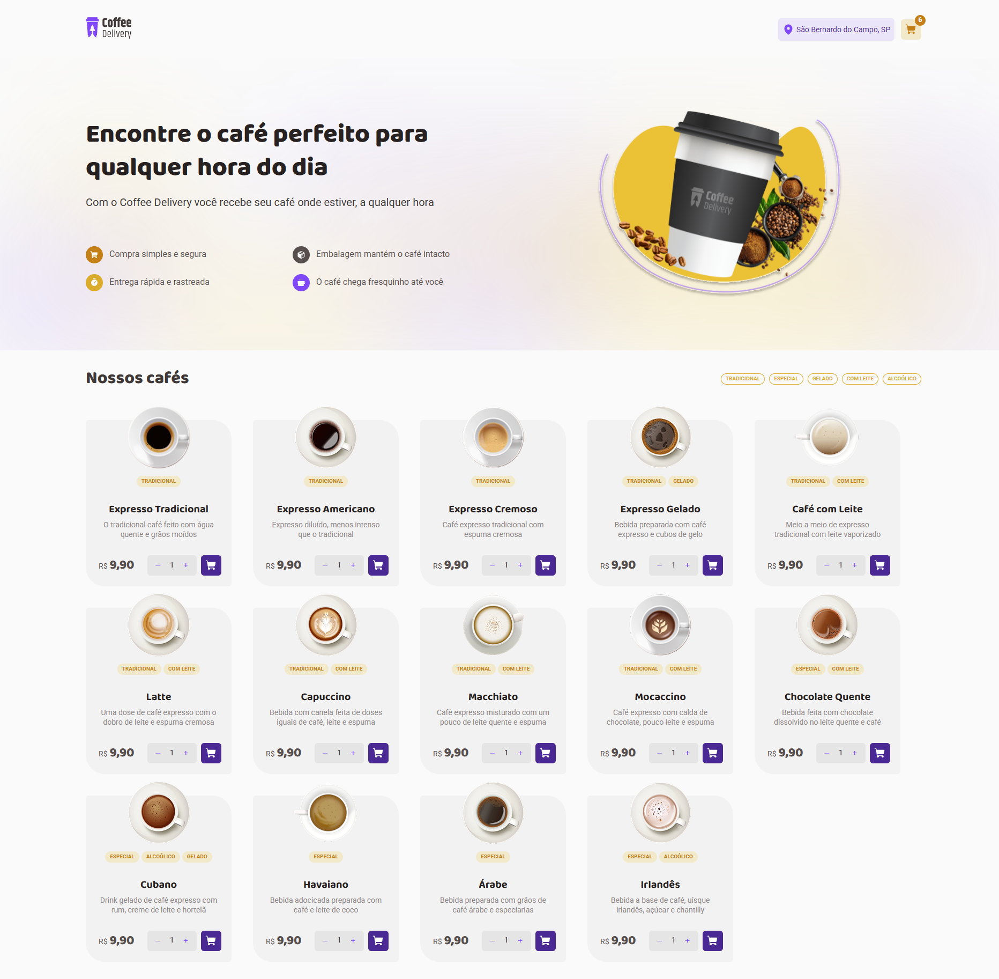
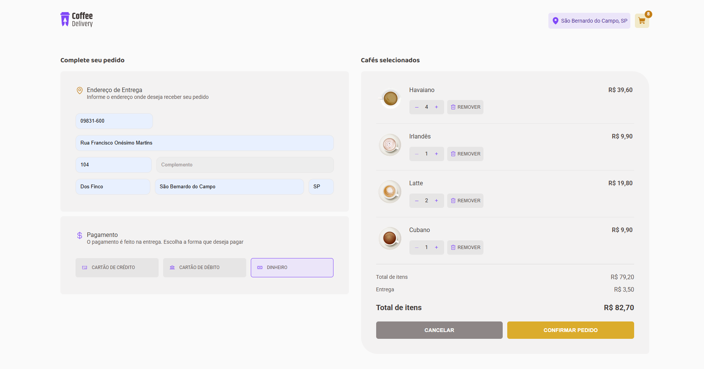
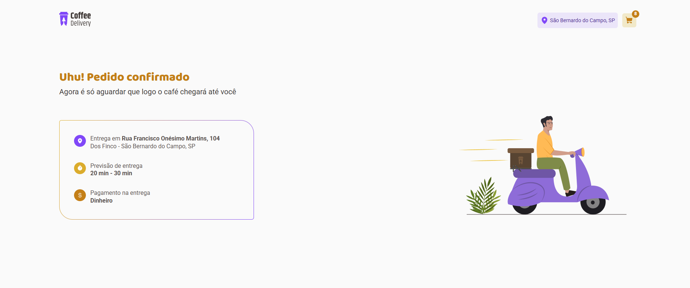

<div align="center">
  
</div>

<h1 align="center">☕ Coffee Delivery</h1>

<p align="center">
  Uma aplicação web para delivery de café desenvolvida em React com TypeScript
</p>

<p align="center">
  🚀 <strong><a href="https://coffee-delivery-7mib39g6l-elenmagalhaes-projects.vercel.app" target="_blank">Ver aplicação em produção</a></strong>
</p>

<p align="center">
  
  
  
  
</p>

<p align="center">
  <a href="#-sobre">Sobre</a>&nbsp;&nbsp;&nbsp;|&nbsp;&nbsp;&nbsp;
  <a href="#-aplicação-em-produção">Demo Live</a>&nbsp;&nbsp;&nbsp;|&nbsp;&nbsp;&nbsp;
  <a href="#-layout">Layout</a>&nbsp;&nbsp;&nbsp;|&nbsp;&nbsp;&nbsp;
  <a href="#-tecnologias">Tecnologias</a>&nbsp;&nbsp;&nbsp;|&nbsp;&nbsp;&nbsp;
  <a href="#-funcionalidades">Funcionalidades</a>&nbsp;&nbsp;&nbsp;|&nbsp;&nbsp;&nbsp;
  <a href="#-como-executar">Como executar</a>&nbsp;&nbsp;&nbsp;|&nbsp;&nbsp;&nbsp;
  <a href="#-licença">Licença</a>
</p>

## 💻 Sobre

O **Coffee Delivery** é uma aplicação de delivery de café desenvolvida com React e TypeScript, onde você pode navegar pelo catálogo de cafés, adicionar produtos ao carrinho e finalizar pedidos. O projeto utiliza Zustand para gerenciamento de estado e React Hook Form para formulários. Desenvolvido como parte do desafio do **Ignite 2022** da Rocketseat.

**Status atual:** Funcionalidades principais implementadas - Sistema de carrinho completo, gerenciamento de estado global e interface responsiva.

### 📈 Últimas atualizações

- ✅ **Gerenciamento de estado completo** - Zustand implementado para controle de carrinho, endereço e pagamento
- ✅ **Funcionalidade de carrinho** - Sistema completo de adicionar/remover produtos e controlar quantidades
- ✅ **Formulários avançados** - React Hook Form integrado para validação e controle de formulários
- ✅ **Componente Typography** - Sistema de tipografia unificado integrado em toda aplicação
- ✅ **Sistema de roteamento** - Navegação completa entre páginas com React Router DOM
- ✅ **Interface responsiva** - Design adaptativo usando Styled Components
- ✅ **Configuração de código** - ESLint e Prettier configurados para manter qualidade do código

## 🎨 Layout

O layout da aplicação foi baseado no design disponível no Figma:

<a href="https://www.figma.com/design/ugJYXnI5DmvsVj8UfVUKpa/Coffee-Delivery--Copy-?node-id=2-1550&t=dYMtvGk839EiJW4a-0">
  
</a>

### 📱 Preview
---

<div align="center">
  
  
  
</div>

## 🚀 Tecnologias

Este projeto foi desenvolvido utilizando as seguintes tecnologias:

- **[React](https://reactjs.org)** - Biblioteca para interfaces de usuário
- **[TypeScript](https://www.typescriptlang.org/)** - Linguagem com tipagem estática
- **[Zustand](https://zustand-demo.pmnd.rs/)** - Gerenciamento de estado global leve e simples
- **[React Hook Form](https://react-hook-form.com/)** - Biblioteca para formulários performáticos com validação
- **[Styled Components](https://styled-components.com/)** - CSS-in-JS para estilização
- **[Phosphor Icons](https://phosphoricons.com/)** - Biblioteca de ícones
- **[React Router DOM](https://reactrouter.com/)** - Roteamento da aplicação
- **[Vite](https://vitejs.dev/)** - Build tool e dev server
- **[ESLint](https://eslint.org/)** - Ferramenta de linting para código
- **[Prettier](https://prettier.io/)** - Formatador de código

---

## 📁 Estrutura do Projeto

```
src/
├── @types/           # Tipos TypeScript customizados
├── components/       # Componentes reutilizáveis
│   ├── CartButton/   # Botão do carrinho com badge de quantidade
│   ├── CoffeeCard/   # Card de produto com controles
│   ├── Flex/         # Componente de layout flexível
│   ├── Header/       # Cabeçalho da aplicação
│   ├── OrderSummary/ # Resumo do pedido no checkout
│   ├── RemoveButton/ # Botão para remover itens do carrinho
│   ├── Select/       # Seletor de quantidade
│   ├── Tag/          # Tags de categorias
│   ├── Typography/   # Sistema de tipografia unificado
│   └── Wrapper/      # Layout wrapper
├── hooks/            # Custom hooks
│   ├── index.ts      # Exportações dos hooks
│   └── useApp.ts     # Hook principal da aplicação
├── pages/            # Páginas da aplicação
│   ├── Home/         # Página principal com catálogo
│   ├── Checkout/     # Página de checkout
│   ├── CheckoutFilled/ # Página de confirmação
│   └── Main/         # Layout principal
├── store/            # Gerenciamento de estado com Zustand
│   └── index.ts      # Store principal (carrinho, endereço, pagamento)
├── theme/            # Sistema de temas e cores
├── utils/            # Utilitários (máscaras, formatadores)
└── constants.ts      # Constantes da aplicação
```

---

## ⚡ Funcionalidades

### ✅ Implementadas

- [x] **Catálogo de cafés** - Visualização de 14 tipos diferentes de café com imagens, descrições e preços
- [x] **Sistema de filtros** - Filtragem por tags (tradicional, especial, gelado, com leite, alcoólico)
- [x] **Carrinho de compras completo** - Adicionar/remover produtos, controle de quantidade, persistência de estado
- [x] **Gerenciamento de estado global** - Zustand implementado para carrinho, endereço e métodos de pagamento
- [x] **Seleção de quantidade** - Controle de quantidade para cada produto com incremento/decremento
- [x] **Interface responsiva** - Design adaptativo usando Styled Components
- [x] **Sistema de temas** - Paleta de cores consistente com o design system
- [x] **Navegação completa** - Roteamento entre páginas (Home, Checkout, CheckoutFilled)
- [x] **Header interativo** - Exibição da localização e contador de itens no carrinho
- [x] **Componentes reutilizáveis** - Typography, Tags, botões, seletores e outros componentes modulares
- [x] **Formatação de valores** - Máscaras para exibição de preços em formato brasileiro (R$)
- [x] **Formulários com validação** - React Hook Form integrado para controle e validação de formulários

### 🚧 Em desenvolvimento

- [ ] **Finalização do pedido** - Integração completa do fluxo de checkout e confirmação
- [ ] **Validação de formulário de endereço** - Validações específicas para CEP e campos obrigatórios
- [ ] **Cálculo dinâmico de frete** - Integração com API de frete baseada no CEP
- [ ] **Persistência no localStorage** - Manter dados do carrinho entre sessões
- [ ] **Página de confirmação** - Layout final da página CheckoutFilled com dados do pedido

### 🧩 Componentes Principais

- **Header** - Navegação com logo, localização e contador de itens no carrinho
- **CoffeeCard** - Card de produto com imagem, descrição, preço e controles de quantidade
- **CartButton** - Botão para adicionar produtos ao carrinho com badge de quantidade
- **Tag** - Sistema de tags para categorização dos produtos (tradicional, especial, etc.)
- **Select** - Seletor de quantidade com botões de incremento/decremento
- **Typography** - Sistema de tipografia unificado com variantes (heading, body, caption)
- **OrderSummary** - Componente de resumo do pedido no checkout
- **RemoveButton** - Botão especializado para remoção de itens do carrinho
- **Flex** - Componente de layout flexível reutilizável

### 💡 Pontos de melhoria

- [ ] **Geolocalização** - Implementar detecção automática da localização do usuário
- [ ] **Integração com API de CEP** - Preenchimento automático do endereço via CEP
- [ ] **Animações** - Transições suaves entre estados e páginas
- [ ] **Acessibilidade** - Melhorias para screen readers e navegação por teclado
- [ ] **Testes** - Implementação de testes unitários e de integração
- [ ] **PWA** - Transformar em Progressive Web App
- [ ] **Otimização de performance** - Lazy loading e code splitting

---

## 🔧 Como executar

### 🌐 Aplicação em Produção

A aplicação está disponível online e pode ser acessada através do link:

**🚀 [Acesse a aplicação em produção aqui](https://coffee-delivery-7mib39g6l-elenmagalhaes-projects.vercel.app)**

---

### Pré-requisitos

Antes de começar, você vai precisar ter instalado em sua máquina:
- [Git](https://git-scm.com)
- [Node.js](https://nodejs.org/en/) (versão 16 ou superior)
- [npm](https://www.npmjs.com/) ou [yarn](https://yarnpkg.com/)

### 🎲 Rodando a aplicação

```bash
# Clone este repositório
$ git clone https://github.com/elenmagalhaes/coffee-delivery-web.git

# Acesse a pasta do projeto no terminal/cmd
$ cd coffee-delivery-web

# Instale as dependências
$ npm install
# ou
$ yarn install

# Execute a aplicação em modo de desenvolvimento
$ npm run dev
# ou
$ yarn dev

# O servidor inciará na porta:5173 - acesse http://localhost:5173
```

### 🏗️ Build para produção

```bash
# Gerar build otimizado
$ npm run build
# ou
$ yarn build

# Visualizar build localmente
$ npm run preview
# ou
$ yarn preview
```

---

## 📝 Licença

Este projeto está sob a licença MIT. Veja o arquivo [LICENSE](LICENSE) para mais detalhes.

---

<div align="center">
  <p>Desenvolvido com ❤️ por <strong>Elen Magalhães</strong></p>
  <p>
    <a href="https://www.linkedin.com/in/ecmrodrigues">
      
    </a>
    <a href="https://github.com/elenmagalhaes">
      
    </a>
  </p>
</div>

---

<p align="center">
  Feito com 💜 no desafio <strong>Ignite</strong> da <a href="https://rocketseat.com.br/">Rocketseat</a> 🚀
</p>
